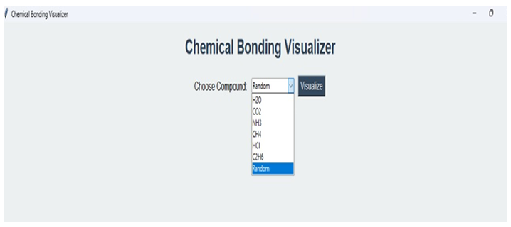
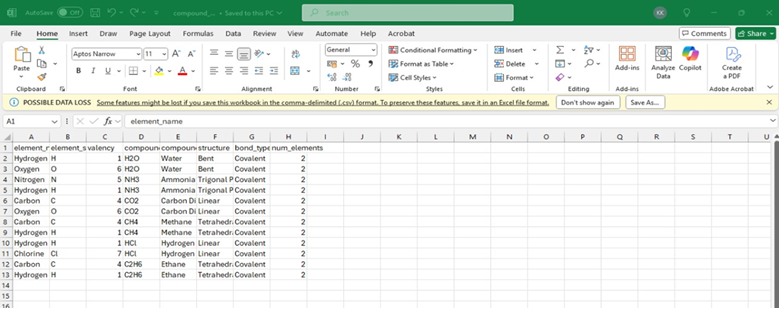
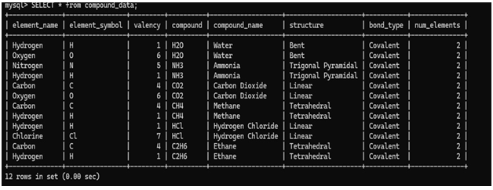
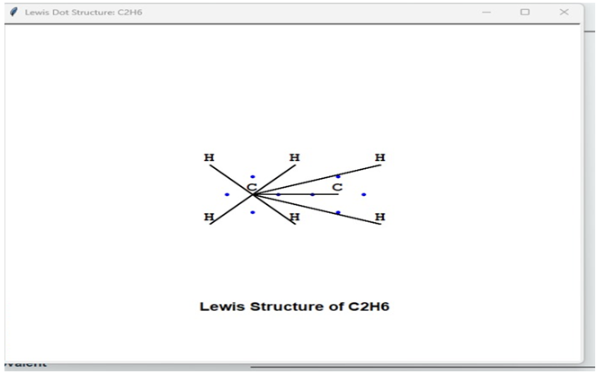
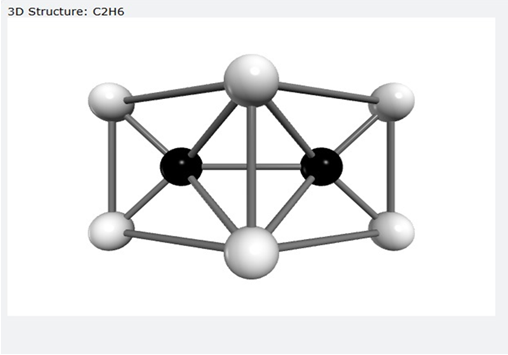

# 🧪 Chemical Bonding Visualizer

An interactive Python-based educational project that visually demonstrates chemical bonding concepts using database integration, 2D structures, and 3D molecular models.

---

## 👩‍💻 About the Developer

**Komal**
17-year-old recent Class 12 graduate from an Army School

This project was created as a school project and personal learning initiative. The idea and concept were fully designed by me.

I am interested in **Artificial Intelligence and Data Science** and explore these fields through self-learning projects.

---

## 💡 Project Inspiration

Chemical bonding concepts such as Lewis structures, molecular geometry, and bond types are often difficult to understand due to their abstract nature.

This project was developed to make these concepts more visual, interactive, and easier to understand for students.

---

## ⚙️ Project Overview

The application demonstrates chemical bonding in common compounds such as:

* Water (H₂O)
* Methane (CH₄)
* Ammonia (NH₃)
* Carbon Dioxide (CO₂)
* Hydrogen Chloride (HCl)
* Ethane (C₂H₆)

It uses a MySQL database to store compound data and provides multiple visualization techniques.

---

## 📌 Features

* 📊 Valency visualization using Matplotlib
* 🧬 2D Lewis structure generation using Turtle graphics
* 🌐 3D molecular visualization using VPython
* 🗂 Data export to CSV using Pandas & SQLAlchemy
* 🖥 Interactive GUI using Tkinter
* 🗄 MySQL database integration

---

## 🛠 Tech Stack

* Python
* MySQL
* Tkinter
* Matplotlib
* Turtle Graphics
* VPython
* Pandas
* SQLAlchemy

---

## 📁 Project Structure

main.py
export_to_csv.py
database.sql
screenshots/

---

## 📸 Screenshots

### Main Interface

### Data Export / Output

### Database View

### Lewis Structure

### 3D Molecular Model

---

## ⚠️ Development Journey

* Built independently with assistance from AI tools for debugging and guidance
* Faced significant challenges during development, including rebuilding parts of the project after encountering incorrect logic suggestions
* This experience highlighted the importance of verifying AI-generated solutions and applying independent problem-solving
* Had to learn multiple libraries (Tkinter, Turtle, VPython, Matplotlib) independently within a short time, which was challenging but significantly improved my adaptability and learning ability
* Strengthened problem-solving, debugging, and self-learning skills
* This experience taught me that AI is a powerful tool, but it must be used carefully with validation and logical understanding

---

## 🎯 Educational Impact

This project helps students:

* Visualize chemical bonding in 2D and 3D
* Understand abstract concepts more easily
* Learn interactively instead of relying only on textbooks

---

## 🚀 Future Scope

* Expand database with more compounds
* Add user-defined compound input
* Improve 3D molecular accuracy
* Add bond formation animations
* Develop a web-based version

---

## ⚖️ Limitations

* Limited to predefined compounds only
* No user input for custom molecules
* Simplified 3D molecular representation
* Performance may vary depending on system capability

---

## 👤 Author

**Komal**
Class 12 Graduate | Interested in Artificial Intelligence and Data Science

---

## 📌 Note

This project showcases how programming and visualization can be used to make abstract chemistry concepts more accessible and engaging for learners.

